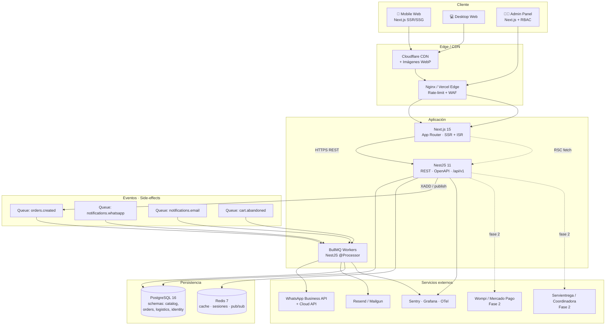
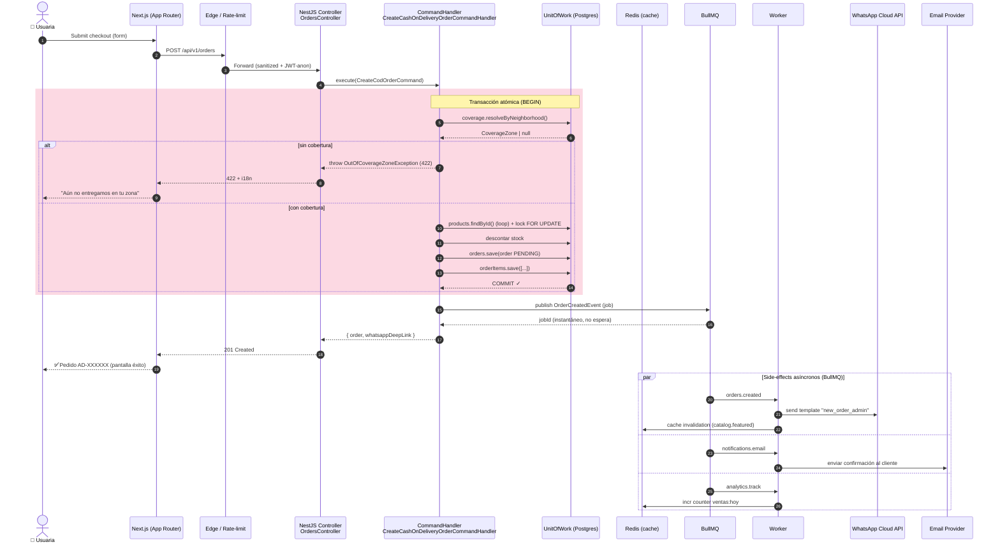

# Artefacto 1 — Arquitectura del Sistema y Flujo de Datos

> Aura Divina · Monolito Modular (NestJS) + Frontend Next.js + Postgres/Redis/BullMQ
> Estilo: Clean Architecture / Hexagonal · Patrón CQRS en módulos pesados

---

## 1.1 Topología de despliegue (alto nivel)

---

## 1.2 Secuencia: "Crear orden contraentrega" (no bloqueante)

**Por qué esto importa:**

- El **CommandHandler** corre dentro de UoW: si falla la inserción del item nº 3, todo el pedido se rollbackea (cero estados huérfanos).
- La validación de cobertura está **antes** del descuento de stock — feedback rápido y cero efectos colaterales si falla.
- Los side-effects pesados (WhatsApp, email, analytics) viven en **BullMQ workers**, no bloquean el hilo de la request → el cliente recibe `201` en < 150 ms.
- BullMQ provee **retries con backoff exponencial**, idempotencia por `jobId` y dead-letter queue (DLQ).
- Pub/Sub Redis se reserva para eventos en tiempo real (notificaciones del admin sobre nuevos pedidos).

---

## 1.3 Decisiones arquitectónicas clave (ADR resumido)

| # | Decisión | Por qué |
|---|----------|---------|
| 1 | Monolito Modular vs microservicios | Equipo pequeño, dominio aún en validación. Bounded contexts limpios = extracción futura barata. |
| 2 | NestJS sobre Express puro | DI container nativo, módulos, decoradores, ecosistema BullMQ + TypeORM, soporte CQRS first-class. |
| 3 | CQRS solo en `Orders` y `Catalog` (lecturas) | Lecturas de catálogo se sirven desde proyecciones cacheadas (Redis); escrituras complejas (orden) usan command handlers transaccionales. |
| 4 | Postgres con TimescaleDB **off** | No tenemos series temporales (todavía). Postgres puro. Schemas separados por bounded context. |
| 5 | Redis multipropósito | Cache de catálogo, sesiones JWT-blacklist, pub/sub admin, BullMQ broker. Una sola pieza de infraestructura. |
| 6 | Pago Contraentrega como Aggregate `Order` | El método de pago es un VO inside `Order`. Fase 2: introducir `Payment` como agregado separado cuando entren pasarelas online. |
| 7 | Frontend Next.js SSR + ISR | SEO en Google Colombia es vital para "anillos Medellín". RSC para data fetching server-side sin spinners. |
