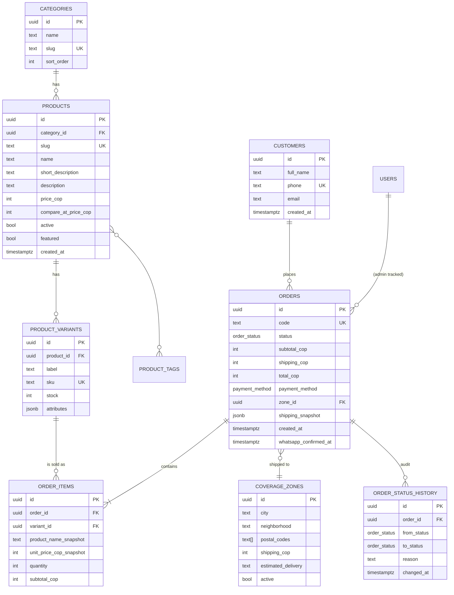
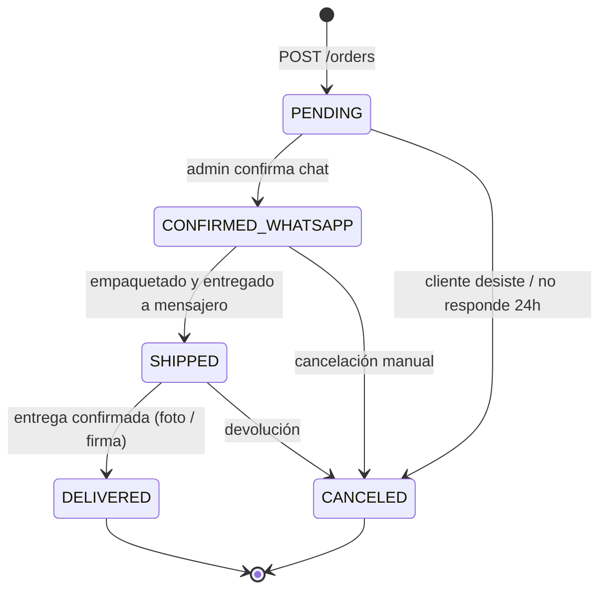

# Artefacto 2 — Modelo de Datos Relacional (PostgreSQL 16)

> Schemas: `catalog`, `orders`, `logistics`, `identity`, `marketing`
> Convenciones: `snake_case`, `BIGSERIAL` solo en logs/audit, `UUID v4` en agregados, `TIMESTAMPTZ` siempre, `MONEY → INTEGER` en COP (centavos no aplican en Colombia, almacenamos pesos enteros).

---

## 2.1 Diagrama ER (resumen)



---

## 2.2 DDL ejecutable (PostgreSQL 16)

```sql
-- ============================================================
--  Aura Divina · Migración 001 — Esquema base
-- ============================================================

CREATE SCHEMA IF NOT EXISTS catalog;
CREATE SCHEMA IF NOT EXISTS orders;
CREATE SCHEMA IF NOT EXISTS logistics;
CREATE SCHEMA IF NOT EXISTS identity;

-- Enums tipados (preferidos sobre CHECK constraints).
CREATE TYPE orders.order_status AS ENUM (
  'PENDING','CONFIRMED_WHATSAPP','SHIPPED','DELIVERED','CANCELED'
);
CREATE TYPE orders.payment_method AS ENUM (
  'CASH_ON_DELIVERY','WOMPI','MERCADO_PAGO','TRANSFER'
);

-- ---------------------- CATÁLOGO ----------------------
CREATE TABLE catalog.categories (
  id          UUID PRIMARY KEY DEFAULT gen_random_uuid(),
  name        TEXT NOT NULL,
  slug        TEXT NOT NULL UNIQUE,
  sort_order  INT  NOT NULL DEFAULT 0,
  created_at  TIMESTAMPTZ NOT NULL DEFAULT now()
);

CREATE TABLE catalog.products (
  id                    UUID PRIMARY KEY DEFAULT gen_random_uuid(),
  category_id           UUID NOT NULL REFERENCES catalog.categories(id) ON DELETE RESTRICT,
  slug                  TEXT NOT NULL UNIQUE,
  name                  TEXT NOT NULL,
  short_description     TEXT,
  description           TEXT,
  price_cop             INT  NOT NULL CHECK (price_cop >= 0),
  compare_at_price_cop  INT  CHECK (compare_at_price_cop >= price_cop),
  active                BOOL NOT NULL DEFAULT TRUE,
  featured              BOOL NOT NULL DEFAULT FALSE,
  created_at            TIMESTAMPTZ NOT NULL DEFAULT now(),
  updated_at            TIMESTAMPTZ NOT NULL DEFAULT now()
);
CREATE INDEX idx_products_active_featured ON catalog.products (active, featured) WHERE active;
CREATE INDEX idx_products_category ON catalog.products (category_id);

CREATE TABLE catalog.product_images (
  id          UUID PRIMARY KEY DEFAULT gen_random_uuid(),
  product_id  UUID NOT NULL REFERENCES catalog.products(id) ON DELETE CASCADE,
  url         TEXT NOT NULL,
  alt         TEXT,
  position    INT  NOT NULL DEFAULT 0
);

CREATE TABLE catalog.product_variants (
  id          UUID PRIMARY KEY DEFAULT gen_random_uuid(),
  product_id  UUID NOT NULL REFERENCES catalog.products(id) ON DELETE CASCADE,
  label       TEXT NOT NULL,
  sku         TEXT NOT NULL UNIQUE,
  stock       INT  NOT NULL DEFAULT 0 CHECK (stock >= 0),
  attributes  JSONB NOT NULL DEFAULT '{}'::jsonb
);
CREATE INDEX idx_variants_product ON catalog.product_variants (product_id);

CREATE TABLE catalog.product_tags (
  product_id UUID REFERENCES catalog.products(id) ON DELETE CASCADE,
  tag        TEXT NOT NULL,
  PRIMARY KEY (product_id, tag)
);

-- ---------------------- LOGÍSTICA ----------------------
CREATE TABLE logistics.coverage_zones (
  id                  UUID PRIMARY KEY DEFAULT gen_random_uuid(),
  city                TEXT NOT NULL,
  neighborhood        TEXT NOT NULL,
  postal_codes        TEXT[] NOT NULL DEFAULT '{}',
  shipping_cop        INT  NOT NULL CHECK (shipping_cop >= 0),
  estimated_delivery  TEXT NOT NULL,
  active              BOOL NOT NULL DEFAULT TRUE,
  created_at          TIMESTAMPTZ NOT NULL DEFAULT now(),
  UNIQUE (city, neighborhood)
);
CREATE INDEX idx_zones_active ON logistics.coverage_zones (active) WHERE active;
CREATE INDEX idx_zones_lookup ON logistics.coverage_zones (lower(city), lower(neighborhood));

-- ---------------------- ÓRDENES ----------------------
CREATE TABLE orders.customers (
  id          UUID PRIMARY KEY DEFAULT gen_random_uuid(),
  full_name   TEXT NOT NULL,
  phone       TEXT NOT NULL UNIQUE,
  email       TEXT,
  created_at  TIMESTAMPTZ NOT NULL DEFAULT now()
);
CREATE INDEX idx_customers_phone ON orders.customers (phone);

CREATE TABLE orders.orders (
  id                      UUID PRIMARY KEY DEFAULT gen_random_uuid(),
  code                    TEXT NOT NULL UNIQUE,
  customer_id             UUID REFERENCES orders.customers(id),
  status                  orders.order_status NOT NULL DEFAULT 'PENDING',
  subtotal_cop            INT  NOT NULL CHECK (subtotal_cop >= 0),
  shipping_cop            INT  NOT NULL CHECK (shipping_cop >= 0),
  total_cop               INT  NOT NULL CHECK (total_cop >= 0),
  payment_method          orders.payment_method NOT NULL,
  zone_id                 UUID NOT NULL REFERENCES logistics.coverage_zones(id),
  shipping_snapshot       JSONB NOT NULL,           -- dirección + nombre congelados al momento del checkout
  notes                   TEXT,
  created_at              TIMESTAMPTZ NOT NULL DEFAULT now(),
  updated_at              TIMESTAMPTZ NOT NULL DEFAULT now(),
  whatsapp_confirmed_at   TIMESTAMPTZ
);
CREATE INDEX idx_orders_status ON orders.orders (status, created_at DESC);
CREATE INDEX idx_orders_customer ON orders.orders (customer_id);
CREATE INDEX idx_orders_created ON orders.orders (created_at DESC);

CREATE TABLE orders.order_items (
  id                        UUID PRIMARY KEY DEFAULT gen_random_uuid(),
  order_id                  UUID NOT NULL REFERENCES orders.orders(id) ON DELETE CASCADE,
  variant_id                UUID NOT NULL REFERENCES catalog.product_variants(id),
  product_name_snapshot     TEXT NOT NULL,
  variant_label_snapshot    TEXT,
  unit_price_cop_snapshot   INT  NOT NULL,
  quantity                  INT  NOT NULL CHECK (quantity > 0),
  subtotal_cop              INT  NOT NULL
);
CREATE INDEX idx_order_items_order ON orders.order_items (order_id);

CREATE TABLE orders.order_status_history (
  id           UUID PRIMARY KEY DEFAULT gen_random_uuid(),
  order_id     UUID NOT NULL REFERENCES orders.orders(id) ON DELETE CASCADE,
  from_status  orders.order_status,
  to_status    orders.order_status NOT NULL,
  changed_by   UUID,                              -- identity.users(id) si aplica
  reason       TEXT,
  changed_at   TIMESTAMPTZ NOT NULL DEFAULT now()
);
CREATE INDEX idx_status_history_order ON orders.order_status_history (order_id, changed_at DESC);

-- ---------------------- IDENTITY ----------------------
CREATE TABLE identity.users (
  id             UUID PRIMARY KEY DEFAULT gen_random_uuid(),
  email          TEXT NOT NULL UNIQUE,
  password_hash  TEXT NOT NULL,                   -- bcrypt cost 12+
  role           TEXT NOT NULL CHECK (role IN ('ADMIN','OPERATOR','SUPPORT')),
  active         BOOL NOT NULL DEFAULT TRUE,
  created_at     TIMESTAMPTZ NOT NULL DEFAULT now(),
  last_login_at  TIMESTAMPTZ
);
```

---

## 2.3 Máquina de estados de la Orden



**Reglas críticas:**

1. **Transiciones validadas en el dominio**, no en SQL. El método `Order.transitionTo(next, reason, by)` valida la legalidad y emite un `OrderStatusChangedEvent`.
2. **Auditoría inmutable** en `order_status_history` (insert-only, sin UPDATE/DELETE) — fundamental para soporte y disputas.
3. **`PENDING → CANCELED` automático** vía cron job `expire-pending-orders` que corre cada hora y descarta órdenes sin confirmación de WhatsApp después de 24 h, devolviendo stock.
4. **`shipping_snapshot`** es JSONB porque la dirección al momento del pedido es histórica e inmutable, aunque la entidad `Customer` cambie después.

---

## 2.4 Estrategia de evolución (Fase 2)

| Cambio Fase 2 | Migración |
|---------------|-----------|
| Pasarela de pago online | `CREATE TABLE orders.payments` con FK a `orders.id`. El método `CASH_ON_DELIVERY` queda como uno más en el enum. |
| Transportadoras | `CREATE TABLE logistics.carriers` + `logistics.shipments` con `tracking_number`. Coverage_zones se complementa con polígonos `POSTGIS`. |
| Multi-tenant | Añadir `tenant_id UUID` con RLS (Row Level Security) por tenant. |
| OTP en checkout | `identity.otp_codes` para validar teléfono antes de aceptar la orden y reducir falsos pedidos. |
