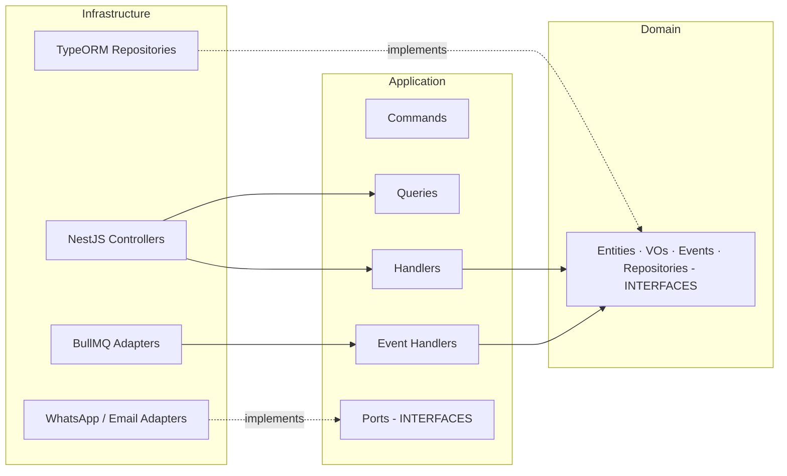

# Artefacto 4 — Estructura de Carpetas (Clean Architecture + CQRS · NestJS)

> Bounded Context: **Orders** (gestión de pedidos contraentrega).
> Las capas se respetan estrictamente: **Domain ← Application ← Infrastructure**. Las flechas siempre apuntan hacia adentro. La capa de Domain no importa nada de NestJS, ORM ni HTTP.

---

## 4.1 Árbol de directorios

```
packages/
└── backend/
    └── src/
        ├── modules/
        │   ├── orders/                          ← Bounded Context "Orders"
        │   │   ├── domain/                      ← Capa Dominio (puro TS, sin frameworks)
        │   │   │   ├── entities/
        │   │   │   │   ├── order.entity.ts            (aggregate root)
        │   │   │   │   ├── order-item.entity.ts
        │   │   │   │   └── order-status-history.entity.ts
        │   │   │   ├── value-objects/
        │   │   │   │   ├── money.vo.ts
        │   │   │   │   ├── phone-co.vo.ts
        │   │   │   │   ├── shipping-address.vo.ts
        │   │   │   │   └── order-status.vo.ts          (state machine)
        │   │   │   ├── events/
        │   │   │   │   ├── order-created.event.ts
        │   │   │   │   ├── order-confirmed-whatsapp.event.ts
        │   │   │   │   └── order-shipped.event.ts
        │   │   │   ├── exceptions/
        │   │   │   │   ├── domain-error.ts
        │   │   │   │   ├── out-of-coverage-zone.exception.ts
        │   │   │   │   ├── insufficient-stock.exception.ts
        │   │   │   │   └── invalid-status-transition.exception.ts
        │   │   │   └── repositories/                   ← PUERTOS (interfaces)
        │   │   │       ├── order.repository.ts
        │   │   │       └── unit-of-work.ts
        │   │   │
        │   │   ├── application/                 ← Capa Aplicación (use cases CQRS)
        │   │   │   ├── commands/
        │   │   │   │   ├── create-cod-order/
        │   │   │   │   │   ├── create-cod-order.command.ts
        │   │   │   │   │   ├── create-cod-order.handler.ts
        │   │   │   │   │   └── create-cod-order.handler.spec.ts
        │   │   │   │   ├── confirm-order-whatsapp/
        │   │   │   │   │   ├── confirm-order-whatsapp.command.ts
        │   │   │   │   │   └── confirm-order-whatsapp.handler.ts
        │   │   │   │   ├── ship-order/
        │   │   │   │   │   ├── ship-order.command.ts
        │   │   │   │   │   └── ship-order.handler.ts
        │   │   │   │   └── cancel-order/
        │   │   │   │       ├── cancel-order.command.ts
        │   │   │   │       └── cancel-order.handler.ts
        │   │   │   ├── queries/
        │   │   │   │   ├── get-order-by-code/
        │   │   │   │   │   ├── get-order-by-code.query.ts
        │   │   │   │   │   └── get-order-by-code.handler.ts
        │   │   │   │   ├── list-orders/
        │   │   │   │   │   ├── list-orders.query.ts
        │   │   │   │   │   └── list-orders.handler.ts
        │   │   │   │   └── orders-dashboard/
        │   │   │   │       └── orders-dashboard.handler.ts
        │   │   │   ├── event-handlers/                 ← Reaccionan a eventos del dominio
        │   │   │   │   ├── on-order-created.handler.ts
        │   │   │   │   └── on-order-confirmed.handler.ts
        │   │   │   ├── ports/                          ← Puertos secundarios (driven)
        │   │   │   │   ├── notification.port.ts
        │   │   │   │   ├── inventory.port.ts
        │   │   │   │   └── coverage.port.ts
        │   │   │   └── dtos/
        │   │   │       ├── create-cod-order.dto.ts     (class-validator)
        │   │   │       ├── shipping-address.dto.ts
        │   │   │       └── order-summary.dto.ts        (read model)
        │   │   │
        │   │   ├── infrastructure/              ← Capa Infraestructura
        │   │   │   ├── controllers/                    ← Adaptadores de entrada (HTTP)
        │   │   │   │   ├── orders.controller.ts        (REST público)
        │   │   │   │   ├── admin-orders.controller.ts  (REST admin · @Roles)
        │   │   │   │   └── orders.controller.spec.ts
        │   │   │   ├── persistence/                    ← Adaptadores de salida (TypeORM)
        │   │   │   │   ├── typeorm/
        │   │   │   │   │   ├── order.typeorm.entity.ts
        │   │   │   │   │   ├── order-item.typeorm.entity.ts
        │   │   │   │   │   └── order-status-history.typeorm.entity.ts
        │   │   │   │   ├── repositories/
        │   │   │   │   │   ├── typeorm-order.repository.ts
        │   │   │   │   │   └── typeorm-unit-of-work.ts
        │   │   │   │   └── mappers/
        │   │   │   │       └── order.mapper.ts         (Domain ⇄ ORM)
        │   │   │   ├── messaging/                      ← BullMQ producers/consumers
        │   │   │   │   ├── orders.processor.ts         (Worker @Processor('orders'))
        │   │   │   │   ├── orders.producer.ts          (encola jobs)
        │   │   │   │   └── orders.queue.config.ts
        │   │   │   ├── notifications/
        │   │   │   │   ├── whatsapp-cloud.adapter.ts   (WhatsApp Business Cloud API)
        │   │   │   │   ├── resend-email.adapter.ts
        │   │   │   │   └── notification-router.ts
        │   │   │   ├── coverage/
        │   │   │   │   └── coverage.adapter.ts         (consume Logistics BC)
        │   │   │   └── inventory/
        │   │   │       └── catalog-inventory.adapter.ts (consume Catalog BC)
        │   │   │
        │   │   ├── orders.module.ts                    ← DI container del módulo
        │   │   └── orders.routes.ts
        │   │
        │   ├── catalog/                          ← otros bounded contexts...
        │   ├── logistics/
        │   └── identity/
        │
        ├── shared/
        │   ├── kernel/                           ← Building blocks DDD reutilizables
        │   │   ├── aggregate-root.ts
        │   │   ├── domain-event.ts
        │   │   ├── value-object.ts
        │   │   ├── entity.ts
        │   │   ├── result.ts                            (Result<T, E>)
        │   │   └── unique-id.ts
        │   ├── exceptions/
        │   │   └── domain-exception.filter.ts            (mapea DomainError → HTTP)
        │   └── decorators/
        │       └── current-user.decorator.ts
        │
        ├── config/
        │   ├── app.config.ts
        │   ├── database.config.ts
        │   ├── redis.config.ts
        │   ├── bullmq.config.ts
        │   └── whatsapp.config.ts
        │
        ├── app.module.ts
        └── main.ts                              ← Bootstrap NestJS + global filters/interceptors
```

---

## 4.2 Reglas de dependencia (dirección de las flechas)



**Lo que NUNCA pasa:**

- ❌ Una entity de dominio importa `@nestjs/common`.
- ❌ Un command handler importa `typeorm`.
- ❌ Un value object hace `fetch()`.
- ❌ Un controlador instancia un repositorio concreto.

**Lo que SÍ pasa:**

- ✅ El controlador llama al `CommandBus.execute(new CreateCodOrderCommand(...))`.
- ✅ NestJS DI inyecta `OrderRepository` (token de interfaz) → resuelve a `TypeOrmOrderRepository` por config en `orders.module.ts`.
- ✅ Cambiar Postgres por MongoDB es solo crear `MongoOrderRepository implements OrderRepository` y reemplazar el provider en el módulo. **El dominio no se entera.**

---

## 4.3 Patrón Unit of Work (con TypeORM)

```ts
// orders/domain/repositories/unit-of-work.ts
export interface UnitOfWork {
  orders: OrderRepository;
  products: ProductRepository;
  coverage: CoverageRepository;
  run<T>(work: (uow: UnitOfWork) => Promise<T>): Promise<T>;
}
```

```ts
// orders/infrastructure/persistence/typeorm-unit-of-work.ts
@Injectable()
export class TypeOrmUnitOfWork implements UnitOfWork {
  constructor(private readonly dataSource: DataSource) {}

  orders!: OrderRepository;
  products!: ProductRepository;
  coverage!: CoverageRepository;

  async run<T>(work: (uow: UnitOfWork) => Promise<T>): Promise<T> {
    return this.dataSource.transaction('SERIALIZABLE', async (manager) => {
      const tx: UnitOfWork = {
        orders: new TypeOrmOrderRepository(manager),
        products: new TypeOrmProductRepository(manager),
        coverage: new TypeOrmCoverageRepository(manager),
        run: () => { throw new Error('No nested UoW'); },
      };
      return work(tx);
    });
  }
}
```

**Por qué SERIALIZABLE:** los descuentos de stock son particularmente sensibles a write-skew. El costo de SERIALIZABLE es bajo en este volumen y nos protege de double-spend de inventario sin tener que escribir locks manuales.

---

## 4.4 Registro en el módulo (DI binding)

```ts
// orders/orders.module.ts
@Module({
  imports: [
    TypeOrmModule.forFeature([OrderTypeOrmEntity, OrderItemTypeOrmEntity]),
    BullModule.registerQueue({ name: 'orders' }),
    CqrsModule,
  ],
  controllers: [OrdersController, AdminOrdersController],
  providers: [
    // Command handlers
    CreateCashOnDeliveryOrderCommandHandler,
    ConfirmOrderWhatsappCommandHandler,
    ShipOrderCommandHandler,
    CancelOrderCommandHandler,
    // Query handlers
    GetOrderByCodeQueryHandler,
    ListOrdersQueryHandler,
    // Event handlers
    OnOrderCreatedHandler,
    OnOrderConfirmedHandler,
    // Bind interfaces -> implementations
    { provide: 'OrderRepository', useClass: TypeOrmOrderRepository },
    { provide: 'UnitOfWork', useClass: TypeOrmUnitOfWork },
    { provide: 'NotificationPort', useClass: NotificationRouter },
    { provide: 'CoveragePort', useClass: CoverageAdapter },
    // BullMQ
    OrdersProcessor,
    OrdersProducer,
  ],
})
export class OrdersModule {}
```

Cualquier handler ahora recibe el `UnitOfWork` por inyección y nunca conoce TypeORM. Los tests unitarios mockean el puerto en una línea.
